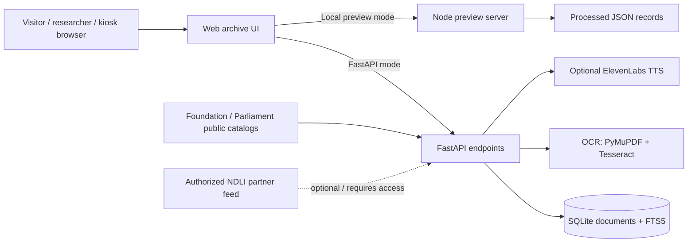

# System Capabilities and Problem Statement Coverage

**Project:** Dr. B. R. Ambedkar Digital Heritage Archive  
**Problem Statement:** SIH 26096 — Digital Heritage Archive for Memorials, Manuscripts & Ambedkar  
**Organization:** Ministry of Social Justice and Empowerment (MoSJE)  
**Department:** Department of Social Justice and Empowerment  
**Category / Theme:** Hardware / Smart Education  
**Document purpose:** Explain which requirements the current repository implements, what visitors and staff can do with it, and what remains planned or dependent on institutional hardware, data, permissions, and services.

> **Status key:** “Implemented” means there is a corresponding software path in this repository. “Partial” means a prototype or conditional feature exists but does not meet the whole requirement. “Planned” means the requirement is described but no operational implementation is present. This is a code-and-data inventory, not an institutional acceptance or production certification.

## 1. Executive summary

This repository contains a working web archive prototype, a FastAPI backend, a local Node preview server, a SQLite/FTS5 search database, document metadata and text files, OCR-assisted upload code, a source-grounded archive assistant, a timeline, and narration paths. It is designed for visitors, students, researchers, and memorial staff to find and inspect archival records through a browser or a kiosk-style interface.

The prototype already supports keyword search, filters, document details, source links, archive statistics, OCR extraction for review, and a timeline. Its current archive assistant retrieves relevant indexed records; it is **not** a generative AI model or a live vector/semantic search system. Narration and OCR depend on browser, API-key, operating-system, and language-pack configuration. The repository does not demonstrate physical kiosk hardware, institutional security and preservation operations, or an approved NDLI data feed.

## 2. What the current system can do

### For visitors, students, and researchers

- Browse the archive and search indexed titles, summaries, text, and tags.
- Filter records by document type, language, and repository/source.
- Read document text and summaries where the indexed record contains them; inspect its date, author, type, source, and reference.
- Open the linked original record, PDF, or source collection when the record includes an official URL.
- Browse a chronological timeline of selected Ambedkar and Constitution-making milestones.
- Ask archive questions in English, Hindi, or Marathi. The assistant searches the available archive content, returns matching source records, and abstains when it finds no supporting record.
- Use browser speech input where supported and configured. Use spoken narration through browser speech synthesis; a configured ElevenLabs service is an optional backend path.
- Use the responsive visitor interface and its browser full-screen/kiosk-mode control.

### For archive staff or developers

- Upload a PDF or image to the OCR endpoint and review the extracted text before adding a record.
- Ingest a structured document through FastAPI's `/api/ingest` endpoint, which stores metadata/content and updates SQLite FTS5.
- Inspect document/source statistics and export the metadata registry or CSV.
- Request public catalog metadata sync for the Dr. Ambedkar Foundation and Parliament Digital Library. The sync adds source records and links; it does not bulk-copy their PDFs or full texts.
- Configure an authorized institutional OAI-PMH endpoint for NDLI-related partner data. Without this endpoint and permission, NDLI records are not claimed as imported.

## 3. Requirement-to-implementation map

| Problem statement requirement | Current implementation | Status and practical limit |
|---|---|---|
| Digital archive for writings, speeches, debates, manuscripts, and records | Web archive UI; normalized JSON records; processed document directory; SQLite `documents` table | **Partial.** Coverage and full-text availability vary by record. A source link or catalog description is not the same as a verified full transcription. |
| AI-powered semantic search | SQLite FTS5 keyword search in FastAPI; local preview server performs text matching over processed records | **Partial.** Keyword/full-text matching is implemented; there is no live embedding model, vector index, or semantic knowledge map. The chunk table is not evidence of a deployed vector search service. |
| Full-text and summarized access | Record schema contains title, summary, tags, and optional full text; detail view shows the fields present | **Partial.** Some records contain text and summaries; catalog-only historical records link to the official source and do not contain the underlying text. |
| OCR-based digitization | `/api/ocr` accepts PDF/image uploads, extracts text, and returns it for review; the UI has an OCR flow | **Partial.** Requires Tesseract and the relevant language data installed on the backend machine. Limits: 20 MB per upload and 50 PDF pages. Human review is required; page-aligned preservation masters and OCR-confidence workflow are not implemented. |
| Multilingual access and translation | English/Hindi/Marathi interface strings; records are tagged with source language; translation fields are supported; limited query-term normalization exists | **Partial.** The corpus metadata reports ten languages, but actual translated text and review status vary by record. Changing the UI language does not translate every archival document. No complete automated translation pipeline is installed. |
| Audio narration | Browser speech synthesis fallback; `/api/tts` optional ElevenLabs multilingual voice integration | **Partial / configuration-dependent.** Browser voice availability varies by browser/device; ElevenLabs needs a valid API key, network access, and provider availability. Narration is generated speech, distinct from archival audio. |
| Audio-video archive | Media metadata fields and official Foundation audio/video source pages can be linked from records | **Partial.** The prototype links to some external audio/video materials; it is not a centralized media preservation, streaming, captioning, or transcript-search platform. |
| Interactive timeline and memorial storytelling | Timeline view with selected milestones and links to related record IDs | **Partial.** A curated timeline exists. A complete source-reviewed storytelling editor and content-management workflow are not present. |
| AI Research Assistant | `/api/assistant` and local preview assistant search archive records and return source records/excerpts/summaries | **Prototype.** Retrieval is based on indexed archive content and fixed matching/summary logic. It is not an integrated general-purpose generative model. Answer quality is limited by the source records and their text; users should verify claims in the linked primary source. |
| Digital preservation and metadata tagging | Stable IDs, JSON metadata, SQLite storage, FTS5 index, processed files, registry/CSV exports | **Partial.** Metadata and searchable storage exist. Preservation masters, checksums, version history, retention policy, restore drills, and complete custody/rights records are not operationally demonstrated. |
| Institutional archive management | Manual ingestion and catalog sync API routes | **Partial.** There is no staff sign-in, role-based access control, editorial approval workflow, audit log, or administration dashboard. Do not expose write endpoints to an untrusted public network as-is. |
| Touch-screen kiosks and smart displays | Responsive web layout and browser kiosk/full-screen control | **Software prototype only.** No physical kiosk/display hardware, device management, session reset policy, or DAIC deployment is included in this repository. |
| Secure, centralized hardware-software platform | FastAPI service and SQLite database can run on one host; separate local Node preview mode reads processed JSON files | **Planned for institutional deployment.** High-availability server/storage, access control, TLS/network configuration, monitoring, backup/recovery, and multi-device acceptance have not been demonstrated. |

## 4. Current technical components

### Main software areas

- `frontend/index.html`, `frontend/app.js`, `frontend/styles.css`: visitor-facing archive, filters, record cards/details, timeline/research views, language controls, and kiosk-mode interface.
- `frontend/preview-server.js`: local preview server. It reads processed JSON records and provides local health, search, stats, document-list, document-detail, and assistant routes. Preview mode is useful when FastAPI dependencies are unavailable; it is not a replacement for all FastAPI features.
- `backend/app.py`: FastAPI API for search, record listing/details, OCR, research assistant, narration, timeline, ingestion, source status/sync, stats, and registry exports.
- `backend/database.py`: SQLite queries, FTS5 search, archive statistics, and assistant source retrieval.
- `backend/ocr.py`: PDF/image validation and Tesseract OCR extraction.
- `ambedkar_archive_data/processed_data/`: normalized JSON document records read by the local preview server.
- `ambedkar_archive_data/database/ambedkar_archive.db`: SQLite catalog, FTS5 index, and embedding-ready chunks table.
- `ambedkar_archive_data/metadata/historical_sources.json`: curated historical references added to the catalog, with official source links and explanatory descriptions.
- `backend/source_ingestion.py`: public Foundation and Parliament catalog metadata connectors and optional authorized OAI-PMH reader.

### FastAPI routes

| Route | Purpose |
|---|---|
| `GET /api/health` | Backend health check |
| `POST /api/search` | Search with language, type, source, limit, and offset filters |
| `GET /api/documents` | Paginated document listing and metadata filters |
| `GET /api/documents/{doc_id}` | Retrieve a document record |
| `GET /api/stats` | Current database counts by language, type, and source |
| `POST /api/ocr` | Extract text from an uploaded supported file for review |
| `POST /api/assistant` | Retrieve archive records relevant to a question |
| `POST /api/tts` | Optional text-to-speech generation through ElevenLabs |
| `GET /api/timeline` | Timeline milestones |
| `POST /api/ingest` | Add one structured document to SQLite and FTS5 |
| `GET /api/sources` | List source catalogs and current access requirements |
| `POST /api/sources/sync` | Incrementally add public catalog metadata and curated historical references |
| `GET /api/export/registry`, `GET /api/export/csv` | Download metadata exports |

## 5. Data and source status

### Sources represented in the current database

The database was inspected on **1 October 2026**. Its observed counts were:

| Source ID | Current database records | Notes |
|---|---:|---|
| `IA` | 510 | Internet Archive references/records in the current database. |
| `CAD` | 12 | Constituent Assembly Debate records, including curated official-source references. |
| `Foundation` | 15 | Dr. Ambedkar Foundation references/records, including curated historical-source entries. |
| `NDL` | 0 | No NDLI partner feed was configured in this environment. |
| **Total** | **537** | Current SQLite count at inspection time. |

The processed JSON directory contained **538 files** during the same inspection, and the older data-inventory report describes a **530-record** snapshot. These totals do not reconcile. Treat counts as a point-in-time development inventory, not an approved production statistic, until the JSON files, registry, and SQLite database are reconciled.

The current database reports 835 embedding-ready chunks, but no live vector index or embedding inference service was found. It reports ten language codes across catalog records; that does not mean every record has been translated into ten languages.

### Historical-source entries in the curated index

The current curated list contains six links/records:

1. Ambedkar's 1916 paper, *Castes in India: Their Mechanism, Genesis and Development*, linked to Foundation Writings and Speeches Volume 1.
2. *Annihilation of Caste*, linked to the same official volume.
3. The Foundation audio-gallery listing for the 17 December 1946 Constituent Assembly speech.
4. The Parliament Digital Library PDF for the Constituent Assembly sitting of 25 November 1949.
5. The Parliament Digital Library date-wise Draft Making Debates collection.
6. The Foundation's Constitution of India reading-resources page.

These are source-linked catalog entries; the curated index does not copy those PDFs or provide complete transcripts for them. Relevant official entry points include the [Foundation Writings and Speeches site](https://drambedkarwritings.gov.in/content/writings-and-speeches.php), the [Foundation audio gallery](https://drambedkarwritings.gov.in/content/audiogallery.php), the [Parliament Digital Library Draft Making collection](https://eparlib.sansad.in/handle/123456789/760448/browse?submit_browse=browse.menu.date&type=date), and the [25 November 1949 debate PDF](https://eparlib.sansad.in/bitstream/123456789/763285/1/cad_25-11-1949.pdf).

NDLI is not counted as loaded. Its published [institutional integration workflow](https://project.ndl.gov.in/service/idr/) describes repository-readiness checks and an MoU/curation process. An authorized feed and permission from the appropriate data partner are prerequisites for harvesting those records.

## 6. Important limitations before presenting this as complete

- **Semantic AI:** describe current discovery as indexed keyword/full-text search. Semantic embeddings, vector retrieval, and relationship/knowledge mapping remain future work.
- **AI assistant:** describe it as an archive retrieval/research assistant prototype. It does not demonstrate a deployed LLM that synthesizes long-form answers, and it can only use records/text that are indexed.
- **Text fidelity:** distinguish source text, OCR output, summaries, translations, and catalog-only entries. Follow each record's source link to verify quotations and historical details.
- **Multilingual support:** UI language, query normalization, record language, document translation, and speech language are separate capabilities; their coverage is not identical.
- **Narration/media:** generated narration is not archival audio. Media links do not establish that source files are locally stored or rights-cleared for redistribution.
- **Rights and access:** review permissions and institutional agreements before downloading, OCR-processing, redistributing, or publishing full-text records.
- **Security:** the current prototype has no staff authentication/roles or demonstrated audit trail. Configure network access and secrets before deployment; the browser interface is not an institutional security boundary.
- **Preservation:** back up the original digital objects and database, add integrity checks, and rehearse recovery before describing the system as a preservation service.
- **Hardware:** a browser kiosk-mode button is not evidence that touch kiosks or smart displays have been procured, installed, or accepted at DAIC.
- **Counts:** use live `/api/stats` only after validating that its database is the intended dataset. Do not copy historic counts from the old inventory report into a presentation without reconciliation.

## 7. Recommended development stages

1. **Reconcile and curate the corpus:** compare processed JSON, registry/CSV, and SQLite; mark full text versus summary versus catalog metadata; verify record identifiers, dates, source URLs, and rights.
2. **Finish archive browsing:** ensure every result can be paged, opened, and cited; add date and collection filters and a save/export reading list.
3. **Improve ingestion and preservation:** add original-object storage, checksums, page associations, OCR review/approval, rights fields, version history, and backups.
4. **Complete language/audio workflows:** expose per-record translation status, add reviewed translations, and evaluate supported browser/device speech and audio controls.
5. **Build semantic retrieval and knowledge mapping:** add an evaluated embedding/vector service and provenance-backed entity/event/work relationships.
6. **Strengthen the research assistant:** if a language model is added, ground answers in retrieved passages, cite exact records/pages, abstain when evidence is weak, and evaluate factuality and language coverage.
7. **Prepare institutional deployment:** implement staff authentication, role permissions, audit logs, secure configuration, monitoring, and recovery procedures.
8. **Pilot physical hardware:** test the application on selected touch kiosks and smart displays at intended resolution and network conditions; validate accessibility and visitor-session clearing.
9. **Integrate NDLI:** obtain institutional authorization/feed details and complete the partner data-readiness and agreement steps before loading NDLI records.

## 8. Suggested concise presentation description

> The current prototype provides a multilingual visitor interface for searching and filtering Ambedkar archive records, opening source-linked documents, exploring a curated timeline, and asking archive-grounded research questions. FastAPI provides SQLite/FTS5 search, OCR-assisted extraction, structured ingestion, statistics, and optional narration; a local preview server can browse the processed JSON catalog. Semantic vector search, complete multilingual translation, comprehensive audiovisual preservation, secure institutional workflows, NDLI harvesting, and physical kiosk deployment remain development or integration stages.

