# Feature Inventory & Specification — Dr. B.R. Ambedkar Digital Heritage Archive
**Problem Statement ID:** 26096 | **Theme:** Smart Education & Cultural Preservation  
**Deployment Target:** Dr. Ambedkar International Centre (DAIC), New Delhi  
**Project Location:** `C:\Users\NITESH\Downloads\MEORIAL_KIOSK\MODELS\PROTOTYPE\ambedkar01\ambedkar`

---

## 1. Feature Map Overview

```mermaid
graph TD
    UI[Kiosk Web Interface] --> F1[1. Sub-Millisecond Hybrid Search]
    UI --> F2[2. Multi-Faceted Filter Hub]
    UI --> F3[3. Chronological Heritage Timeline]
    UI --> F4[4. Constitutional Research Assistant]
    UI --> F5[5. Dual-Engine Audio Narration TTS]
    UI --> F6[6. Voice Speech-to-Text Input]
    UI --> F7[7. Document Deep Inspection Modal]
    UI --> F8[8. Multilingual Interface Switcher]
    UI --> F9[9. Ingestion Pipeline & OCR Studio]
    UI --> F10[10. Institutional Analytics & Export]
    UI --> F11[11. Kiosk Fullscreen & Accessibility]
    UI --> F12[12. Multi-Tier Deployment Network]
```

---

## 2. Comprehensive Feature Specifications

### Feature 1: Sub-Millisecond Full-Text Search (SQLite FTS5)
- **Category:** Core Retrieval Engine
- **Files Involved:** [`backend/database.py`](file:///C:/Users/NITESH/Downloads/MEORIAL_KIOSK/MODELS/PROTOTYPE/ambedkar01/ambedkar/backend/database.py), [`backend/app.py`](file:///C:/Users/NITESH/Downloads/MEORIAL_KIOSK/MODELS/PROTOTYPE/ambedkar01/ambedkar/backend/app.py) (`/api/search`), [`frontend/app.js`](file:///C:/Users/NITESH/Downloads/MEORIAL_KIOSK/MODELS/PROTOTYPE/ambedkar01/ambedkar/frontend/app.js) (`executeSearch()`).
- **Description:** Performs ultra-low-latency lexical keyword matching across titles, summaries, full transcribed text, and tags.
- **Performance:** Measured query response time is **0.5 ms to 1.8 ms**, outperforming the government's 2.0-second SLA target by over 1,000x.
- **Capabilities:**
  - Tokenized query matching with prefix search (`term*`).
  - Supports search in English, Hindi, and regional scripts.
  - Highlights matching record count and query latency in milliseconds on the UI.
- **Fallback:** If the backend is offline, the frontend seamlessly executes client-side filtering over embedded JSON records (`FALLBACK_DOCS`).

---

### Feature 2: Multi-Faceted Archival Filtering
- **Category:** Search & Discovery
- **Files Involved:** [`frontend/index.html`](file:///C:/Users/NITESH/Downloads/MEORIAL_KIOSK/MODELS/PROTOTYPE/ambedkar01/ambedkar/frontend/index.html), [`frontend/app.js`](file:///C:/Users/NITESH/Downloads/MEORIAL_KIOSK/MODELS/PROTOTYPE/ambedkar01/ambedkar/frontend/app.js).
- **Description:** Allows visitors and researchers to refine 530+ archival records across 3 independent taxonomies:
  1. **Language Filter:** All (10 Languages), English (410), Hindi (42), Telugu (27), Marathi (18), Bengali (11), Tamil (9), Gujarati (9), Punjabi (2), Malayalam (1), Kannada (1).
  2. **Document Type Filter:** Publications (423), Speeches (63), CAD Debates (20), Manuscripts (4), Historical Records (20).
  3. **Repository Source Filter:** Internet Archive (510), Constituent Assembly (10), Dr. Ambedkar Foundation (10).
- **Quick-Concept Chips:** One-tap shortcut buttons for recurring research topics: *CAD Debates, Annihilation of Caste, Directive Principles, Untouchability, Economics & RBI, Buddhism & Dhamma*.

---

### Feature 3: Interactive Chronological Heritage Timeline
- **Category:** Educational & Memorial Storytelling
- **Files Involved:** [`backend/app.py`](file:///C:/Users/NITESH/Downloads/MEORIAL_KIOSK/MODELS/PROTOTYPE/ambedkar01/ambedkar/backend/app.py) (`/api/timeline`), [`frontend/app.js`](file:///C:/Users/NITESH/Downloads/MEORIAL_KIOSK/MODELS/PROTOTYPE/ambedkar01/ambedkar/frontend/app.js) (`loadTimeline()`).
- **Description:** An interactive chronological pathway tracing 11 defining constitutional and social milestones in Dr. Ambedkar's life:
  - 1916: *Castes in India* paper at Columbia University.
  - 1920: Launch of *Muknayak* fortnightly journal.
  - 1923: *Problem of the Rupee* (London School of Economics / RBI origins).
  - 1927: Mahad Satyagraha (Civic drinking water rights at Chavdar Tale).
  - 1932: Poona Pact Agreement with Mahatma Gandhi.
  - 1936: Publication of *Annihilation of Caste*.
  - 1946: Maiden address to the Constituent Assembly.
  - 1947: Appointed Chairman of the Constitution Drafting Committee.
  - 1948: Presentation of the Draft Constitution of India.
  - 1948: Unanimous adoption of Article 17 (Abolition of Untouchability).
  - 1949: Final Constituent Assembly address ("Grammar of Anarchy").
  - 1956: Historical Buddhist conversion at Deekshabhoomi, Nagpur.
- **Deep-Link Integration:** Each timeline milestone card features a *"Read Original Historical Record"* button that directly opens the primary archival scan and transcript in the document inspection modal.

---

### Feature 4: Archival Research Assistant (Q&A Interface)
- **Category:** AI Research & Grounded Assistance
- **Files Involved:** [`backend/app.py`](file:///C:/Users/NITESH/Downloads/MEORIAL_KIOSK/MODELS/PROTOTYPE/ambedkar01/ambedkar/backend/app.py) (`/api/assistant`), [`frontend/app.js`](file:///C:/Users/NITESH/Downloads/MEORIAL_KIOSK/MODELS/PROTOTYPE/ambedkar01/ambedkar/frontend/app.js) (`handleAiSubmit()`).
- **Description:** A dedicated research chat panel allowing visitors to ask constitutional and biographical questions.
- **Preset Historical Prompts:**
  - *Hero Worship / Bhakti in Politics*
  - *Parliamentary vs Presidential System*
  - *Article 356 as 'Dead Letter'*
  - *Caste as Division of Labourers*
- **Source Citations:** Answers include clickable evidence cards showing:
  - Document Title and Author
  - Historical Date and Source Archive
  - Relevant Quote Excerpt
  - "View Source" button opening the full primary document.

---

### Feature 5: Dual-Engine Audio Narration (Text-to-Speech)
- **Category:** Multimodal Accessibility
- **Files Involved:** [`backend/app.py`](file:///C:/Users/NITESH/Downloads/MEORIAL_KIOSK/MODELS/PROTOTYPE/ambedkar01/ambedkar/backend/app.py) (`/api/tts`), [`frontend/app.js`](file:///C:/Users/NITESH/Downloads/MEORIAL_KIOSK/MODELS/PROTOTYPE/ambedkar01/ambedkar/frontend/app.js) (`toggleAudioNarration()`).
- **Description:** Delivers spoken audio playback of document summaries, key quotes, and titles to serve visually impaired, elderly, or low-literacy visitors.
- **Dual-Engine Architecture:**
  1. **Primary Engine (Cloud):** ElevenLabs Multilingual V2 (`eleven_multilingual_v2`) using a configured voice profile for high-fidelity natural pacing.
  2. **Fallback Engine (Offline Local):** Browser native `window.speechSynthesis` using Indian locale voice profiles:
     - English: `en-IN`
     - Hindi: `hi-IN`
     - Marathi: `mr-IN`
- **Controls:** Play/Pause button, real-time status display (`Connecting`, `Playing`, `Ready`), and automatic playback cleanup on modal close.

---

### Feature 6: Speech-to-Text Voice Query Input
- **Category:** Touch Kiosk & Voice UX
- **Files Involved:** [`frontend/index.html`](file:///C:/Users/NITESH/Downloads/MEORIAL_KIOSK/MODELS/PROTOTYPE/ambedkar01/ambedkar/frontend/index.html) (`#aiVoiceBtn`), [`frontend/app.js`](file:///C:/Users/NITESH/Downloads/MEORIAL_KIOSK/MODELS/PROTOTYPE/ambedkar01/ambedkar/frontend/app.js) (`toggleAiVoiceInput()`).
- **Description:** Enables visitors to speak questions aloud into the kiosk microphone instead of typing.
- **Technology:** Integrates the HTML5 Web Speech API (`SpeechRecognition` / `webkitSpeechRecognition`).
- **Multilingual Recognition:** Dynamically selects the speech recognition locale matching the UI language (`en-IN`, `hi-IN`, `mr-IN`).
- **Interim Feedback:** Displays real-time interim speech transcription directly inside the input box as the visitor speaks.

---

### Feature 7: Document Detail Inspection Modal
- **Category:** Curatorial & Scholarly Viewer
- **Files Involved:** [`frontend/index.html`](file:///C:/Users/NITESH/Downloads/MEORIAL_KIOSK/MODELS/PROTOTYPE/ambedkar01/ambedkar/frontend/index.html) (`#docModal`), [`frontend/app.js`](file:///C:/Users/NITESH/Downloads/MEORIAL_KIOSK/MODELS/PROTOTYPE/ambedkar01/ambedkar/frontend/app.js) (`openDocModal()`).
- **Description:** A slide-over modal window displaying complete archival metadata and transcript for any selected record.
- **Sections Included:**
  1. **Header Badges:** Document Type, Repository Provenance, Historical Date.
  2. **Audio Narration Bar:** Spoken readout trigger for the active record.
  3. **Executive Summary:** Concise contextual overview of the work.
  4. **Key Historical Quotes:** Formatted blockquotes with amber accent styling.
  5. **Archival Full Text / Excerpt:** Scrollable, monospace verbatim text transcript.
  6. **Dublin Core Metadata Grid:** Identifier, Archive Reference, Word Count, Language, Physical Condition, Access Rights.
  7. **Primary Source Deep-Link:** External anchor linking to verified official PDF mirrors (e.g. Sansad eparlib, MEA BAWS volume links).

---

### Feature 8: Dynamic Multilingual UI Localization
- **Category:** Linguistic Inclusion
- **Files Involved:** [`frontend/app.js`](file:///C:/Users/NITESH/Downloads/MEORIAL_KIOSK/MODELS/PROTOTYPE/ambedkar01/ambedkar/frontend/app.js) (`setUiLanguage()`, `UI_TRANSLATIONS`, `TIMELINE_TRANSLATIONS`).
- **Supported Languages:** **English (EN)**, **Hindi (हिंदी)**, and **Marathi (मराठी)**.
- **Implementation:** Custom DOM TreeWalker traversal (`applyUiTranslations()`) that dynamically updates text nodes, button labels, placeholders, aria attributes, and filter options without triggering a page reload.
- **Persistence:** Remembers the user's selected language in `localStorage`.

---

### Feature 9: Ingestion Pipeline & OCR Studio
- **Category:** Archival Administration & Digitization
- **Files Involved:** [`backend/app.py`](file:///C:/Users/NITESH/Downloads/MEORIAL_KIOSK/MODELS/PROTOTYPE/ambedkar01/ambedkar/backend/app.py) (`/api/ocr`, `/api/ingest`), [`backend/ocr.py`](file:///C:/Users/NITESH/Downloads/MEORIAL_KIOSK/MODELS/PROTOTYPE/ambedkar01/ambedkar/backend/ocr.py), [`frontend/app.js`](file:///C:/Users/NITESH/Downloads/MEORIAL_KIOSK/MODELS/PROTOTYPE/ambedkar01/ambedkar/frontend/app.js).
- **Description:** An institutional workflow allowing curators and memorial staff to digitize newly acquired materials.
- **Workflow:**
  1. Upload a scanned manuscript or printed PDF/image.
  2. Select OCR mode (Printed Text vs Handwriting Model) and document language.
  3. Extract text using Tesseract and multi-page PyMuPDF rendering.
  4. Review and edit the extracted text in a side-by-side editing box.
  5. Enter Dublin Core metadata (Title, Author, Historical Date, Type, Tags).
  6. Ingest directly into the database: automatically inserts into SQLite `documents` table, indexes into FTS5 virtual table, and writes a backup JSON to `processed_data/`.

---

### Feature 10: Institutional Analytics & Data Export
- **Category:** Reporting & Governance
- **Files Involved:** [`backend/app.py`](file:///C:/Users/NITESH/Downloads/MEORIAL_KIOSK/MODELS/PROTOTYPE/ambedkar01/ambedkar/backend/app.py) (`/api/stats`, `/api/export/*`), [`frontend/app.js`](file:///C:/Users/NITESH/Downloads/MEORIAL_KIOSK/MODELS/PROTOTYPE/ambedkar01/ambedkar/frontend/app.js) (`loadStats()`).
- **Description:** Live dashboard summarizing the state of the digital archive.
- **Live Metrics:**
  - Total Digitized Records (530+)
  - Total Words Indexed (86,624+)
  - Vector RAG Chunks Generated (835)
  - Number of Indian Languages (10)
- **Visual Distributions:** Language percentage breakdown bars and repository source provenance breakdown.
- **Export Endpoints:**
  - `/api/export/registry`: Download complete `registry.json`.
  - `/api/export/csv`: Download `combined_metadata.csv` for spreadsheet analysis.

---

### Feature 11: Touch Kiosk Fullscreen Mode & Accessibility
- **Category:** Hardware Kiosk Optimization
- **Files Involved:** [`frontend/index.html`](file:///C:/Users/NITESH/Downloads/MEORIAL_KIOSK/MODELS/PROTOTYPE/ambedkar01/ambedkar/frontend/index.html), [`frontend/styles.css`](file:///C:/Users/NITESH/Downloads/MEORIAL_KIOSK/MODELS/PROTOTYPE/ambedkar01/ambedkar/frontend/styles.css).
- **Description:** Optimized for physical exhibition touchscreens and smart displays.
- **Capabilities:**
  - One-touch Fullscreen toggle (`toggleFullScreen()`).
  - Chromium App-Mode compatibility (`--app=http://localhost:8000`) removing browser toolbars, address bars, and navigation buttons.
  - Dark / Light theme toggle.
  - WCAG 2.1 AA accessibility: Keyboard focus navigation (`:focus-visible`), high-contrast modes (`@media (prefers-contrast: more)`), reduced motion overrides (`@media (prefers-reduced-motion: reduce)`), and forced colors support.

---

### Feature 12: Multi-Tier Network Deployment Suite
- **Category:** DevOps & Network Engineering
- **Files Involved:** Deployment scripts in project root.
- **Supported Modes:**
  1. **Localhost Standalone:** `start-local.ps1` (`127.0.0.1:8000`).
  2. **Local Area Network (LAN):** `start-lan.ps1` (`0.0.0.0:8000`, firewall rule addition, auto-IP discovery for Wi-Fi hotspot sharing with tablets and phones).
  3. **Global Internet WAN:** `start-wan-tunnel.bat` (Encrypted Cloudflare Quick Tunnel via bundled `cloudflared.exe` providing instant `https://*.trycloudflare.com` links).
  4. **Single-File Distribution:** `create-package.bat` (Generates portable `ambedkar-archive-package.zip`).
  5. **Zero-Latency Wired Kiosk:** ADB reverse port forwarding (`adb reverse tcp:8000 tcp:8000`) connecting an Android touch display directly to the server via USB.
