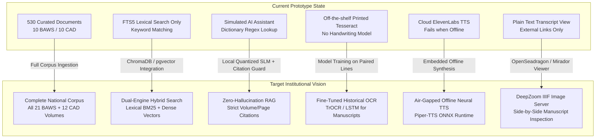

# What to Be Done to Match Vision — Dr. B.R. Ambedkar Digital Heritage Archive
**Problem Statement ID:** 26096 | **Ministry:** Ministry of Social Justice and Empowerment (MoSJE)  
**Primary Institutional Stakeholder:** Dr. Ambedkar International Centre (DAIC), New Delhi  
**Reference Vision Source:** `C:\Users\NITESH\Downloads\MEMROIAL DOCS` (Dossier, Deep Problem Analysis, Requirements)

---

## 1. The Vision vs. Current State Gap Analysis

The official vision set forth by the Ministry of Social Justice and Empowerment (MoSJE) for Problem Statement 26096 is:
> *"Develop an AI-enabled Digital Heritage Archive and Institutional Knowledge Platform dedicated to Dr. Ambedkar. The system will integrate hardware and software components such as interactive kiosks, smart displays, centralized archival servers, and AI-powered search tools... Visitors will be able to search, study, listen to, and compile Ambedkar’s writings, speeches, and historical records. The platform will promote digital preservation, constitutional awareness, accessible learning, and immersive heritage experiences."*

While the current prototype successfully demonstrates the foundational UI, FTS5 search, and basic deployment scripts, the following architectural transformations are required to fully realize the government's mandate:

---

## 2. Strategic Pillars Required to Match the Vision

### Pillar 1: Ingestion of the Full National Archival Corpus
- **Current Limitation:** The repository indexes 530 records, but only 10 are from the Dr. Ambedkar Foundation (BAWS) and 10 from the Constituent Assembly Debates. 510 items are broad Internet Archive catalog entries.
- **Required Action:**
  1. **Complete 21 Volumes of BAWS:** Ingest all 21 official volumes published by the Dr. Ambedkar Foundation in English, Hindi, and Marathi (~15,000+ pages). Each volume must be broken down by chapter, speech, and section with exact page numbers.
  2. **Complete 12 Volumes of CAD:** Ingest the full official verbatim transcripts of the Constituent Assembly Debates (December 9, 1946 – January 24, 1950) from the Lok Sabha Secretariat archives.
  3. **Columbia & LSE Dissertations:** Ingest full verified texts of Dr. Ambedkar's seminal economic dissertations: *The Evolution of Provincial Finance in British India* (Columbia, 1925) and *The Problem of the Rupee: Its Origin and Its Solution* (LSE, 1923).
  4. **State Archives & Legislative Proceedings:** Collect and index Dr. Ambedkar's speeches in the Bombay Legislative Council (1927–1939) and the Viceroy's Executive Council (1942–1946).

---

### Pillar 2: Transition from Simulated Search to True Hybrid Retrieval
- **Current Limitation:** The current search uses SQLite FTS5 lexical matching. The "AI Assistant" does not run dense semantic embeddings or an LLM—it runs a hardcoded dictionary (`ASSISTANT_QUERY_TERMS`) matching keywords against summaries.
- **Required Action:**
  1. **Dense Vector Indexing:** Connect the 835 existing partitioned chunks (and expand to all ~25,000 chunks across BAWS) into an embedded vector store (`ChromaDB` or `sqlite-vec` for air-gapped kiosks, or PostgreSQL `pgvector` for centralized servers).
  2. **Reciprocal Rank Fusion (RRF):** Combine FTS5 BM25 lexical keyword scores with dense vector cosine similarity:
     $$\text{RRF Score}(d) = \frac{w_{\text{lexical}}}{60 + \text{rank}_{\text{lexical}}(d)} + \frac{w_{\text{dense}}}{60 + \text{rank}_{\text{dense}}(d)}$$
  3. **Multilingual Embeddings:** Utilize cross-lingual models such as `sentence-transformers/paraphrase-multilingual-MiniLM-L12-v2` or `BAAI/bge-m3` so a user querying in Marathi or Hindi directly retrieves the corresponding English constitutional passage and vice-versa.

---

### Pillar 3: Grounded Zero-Hallucination AI Research Assistant
- **The Government Mandate:** *"A system that paraphrases Ambedkar is worse than one that simply finds him."*
- **Required Action:**
  1. **Strict Citation Prompt Template:** Connect the retrieval engine to an offline quantized Small Language Model (SLM) such as `Llama-3-8B-Instruct-Q4_K_M` running via `llama.cpp` or an institutional LLM endpoint.
  2. **Verifiable Citation Output:** The AI assistant must never generate unverified summaries. Every statement must be accompanied by:
     - Exact Volume Number (e.g., *BAWS Vol. 1, p. 54* or *CAD Vol. VII, p. 322*).
     - Exact Date of Speech / Debate (e.g., *25th November 1949*).
     - Direct deep-link to the scanned archival page in the viewer.
  3. **Refusal Guardrail:** If an asked question cannot be grounded in the indexed primary corpus, the assistant must explicitly refuse to answer rather than speculating.

---

### Pillar 4: Training & Integration of Handwriting OCR
- **Current Limitation:** Off-the-shelf Tesseract produces empty or corrupted text when processing cursive, crossed-out historical manuscripts.
- **Required Action:**
  1. **Dataset Assembly:** Utilize the workflow defined in `HANDWRITING_OCR_TRAINING.md` and `backend/prepare_handwriting_data.py`. Assemble at least 500–1,000 paired line-image crops of Dr. Ambedkar's draft notes and letters with verified diplomatic transcriptions.
  2. **Model Training:**
     - **Option A (Tesseract LSTM):** Fine-tune the `eng.traineddata` LSTM layer using `lstmtraining` on the curated manuscript lines to output `ambedkar_handwritten_v2.traineddata`.
     - **Option B (Deep Learning TrOCR):** Fine-tune Microsoft's `TrOCR-large-handwritten` or `PaddleOCR` on the manuscript dataset for significantly higher accuracy on cursive scripts.
  3. **Backend Integration:** Replace the stubbed check in `backend/ocr.py` so that selecting "Handwriting mode" runs the fine-tuned inference model and outputs the transcribed text with confidence scores.

---

### Pillar 5: DeepZoom / IIIF Digital Manuscript Viewer
- **Current Limitation:** When a visitor clicks "Inspect" on a document, they see a text modal with an external link. If the document is an old manuscript or rare gazette, there is no high-resolution visual inspection.
- **Required Action:**
  1. **Embedded IIIF / DeepZoom Viewer:** Embed `OpenSeadragon` into `docModal`.
  2. **Side-by-Side Presentation:** Split the modal into two synchronized panes:
     - **Left Pane:** High-resolution zoomable scan of the original physical page (showing ink, stamps, handwriting, and paper texture).
     - **Right Pane:** Searchable, verified transcript with line-by-line alignment and audio narration controls.

---

### Pillar 6: 100% Air-Gapped Offline Resilience for Museum Kiosks
- **Current Limitation:** High-fidelity TTS relies on ElevenLabs cloud API. In a physical museum or memorial kiosk at DAIC, internet connectivity cannot be guaranteed, and API quotas will exhaust during peak visitor traffic.
- **Required Action:**
  1. **Embedded Neural TTS:** Integrate `Piper-TTS` (an ultra-fast, local ONNX-based neural TTS engine).
  2. **Regional Indian Voice Models:** Bundle offline voice models for Indian English, Hindi, and Marathi. This provides natural, lifelike audio narration directly on the kiosk hardware with zero latency and zero internet dependency.
  3. **Offline Service Worker / PWA:** Register a service worker in `frontend/index.html` to cache all UI fonts, Tailwind assets, and FontAwesome icons locally so the kiosk boots instantly even with the network cable unplugged.

---

### Pillar 7: Kiosk Physical Hardening & Exhibition UX
- **Required Action for Memorial Kiosk Stations:**
  1. **Virtual On-Screen Touch Keyboard:** When a visitor taps the search bar or AI assistant input on a touch kiosk without a physical keyboard, an on-screen multilingual touch keyboard must appear.
  2. **Inactivity Screen Saver / Attract Loop:** If no touch interaction is detected for 90 seconds, the kiosk should smoothly transition to an "Attract Loop" showing historic archival footage, inspiring Ambedkar quotes, and a "Touch Screen to Begin" prompt.
  3. **Restricted Shell / Browser Lockdown:** Configure Windows Assigned Access or a Chromium lockdown wrapper so memorial visitors cannot close the window, switch tasks, or open external desktop applications.

---

## 3. Implementation Phasing Matrix to Match Vision

| Phase | Milestone Objective | Deliverables | Target Timeline |
| :--- | :--- | :--- | :--- |
| **Phase 1** | **Corpus Scaling & Full Ingestion** | Ingest all 21 BAWS volumes + 12 CAD volumes; standardize 15,000+ page records. | 1–2 Weeks |
| **Phase 2** | **Hybrid Search & Vector Indexing** | Deploy local ChromaDB vector store; fuse FTS5 and vector rankings; multilingual querying. | 1 Week |
| **Phase 3** | **Offline Neural TTS & Speech Audio** | Embed Piper-TTS (Hindi, Marathi, English); air-gapped narration independent of ElevenLabs. | 3–4 Days |
| **Phase 4** | **Side-by-Side DeepZoom Viewer** | Integrate OpenSeadragon for high-res manuscript scans alongside text transcripts. | 4–5 Days |
| **Phase 5** | **Handwriting OCR Model Fine-Tuning** | Label 500 line pairs; fine-tune TrOCR/Tesseract LSTM; deploy custom model. | 1–2 Weeks |
| **Phase 6** | **Kiosk Hardening & Institutional Sync** | On-screen touch keyboard; inactivity attract screen saver; OAI-PMH metadata harvesting. | 1 Week |
